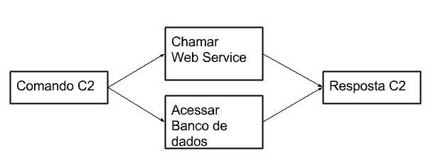
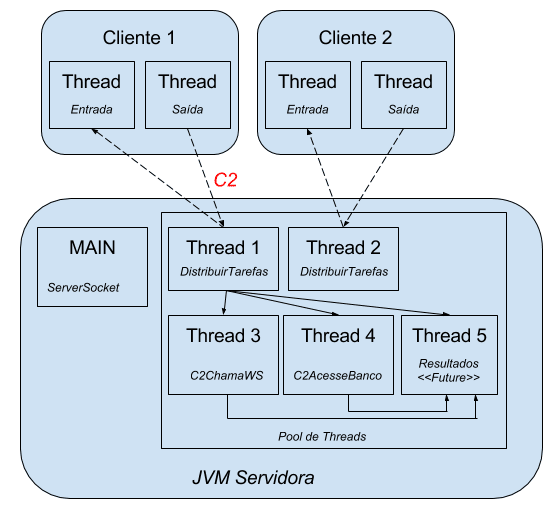
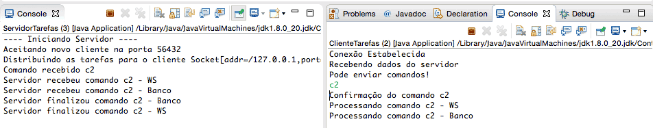
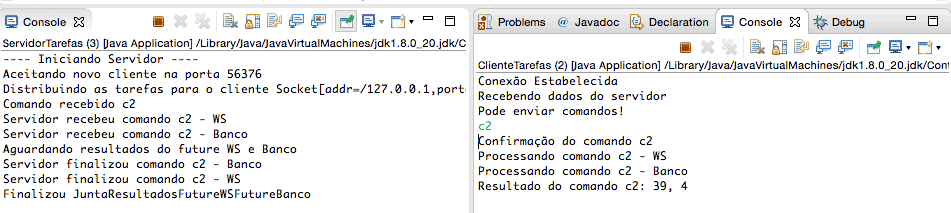

# Callable

- Já falamos antes que o nosso ComandoC2 fará algo diferente do que ComandoC1. Até agora ambos foram implementados de maneira igual. A nossa motivação é a seguinte: para executar o ComandoC2 é preciso acessar dois recursos externos, um banco de dados e um serviço web. Ambos demoram e em alguns casos não terminam corretamente por causa de possíveis problemas na rede. É preciso lidar com esses problemas e o resultado de ambas as execuções deve ser combinado em um único resultado!



- A nossa ideia é aproveitar as threads o máximo possível e executar cada acesso, banco e web service, em uma thread separada. Com isso não há problema nenhum, no entanto o resultado dessa execução deve ser combinado e devolvido ao cliente. Agora já temos um problema...

## Tarefas com retorno, o Callable
- Já vimos algumas formas de como threads podem compartilhar dados, por exemplo, usando objetos com acesso sincronizado, e poderíamos usar uma implementação baseada nessa ideia. Com a introdução do pacote java.util.concurrent, entraram outras possibilidades de resolver este problema, que vamos explorar nesse capítulo.

- Até agora aprendemos que uma thread precisa de uma tarefa que deve implementar a interface Runnable. O problema da interface Runnable é que o método run() não retorna nada. Isso foi resolvido no Java 5 através de uma nova interface: Callable. Ao invés de criar uma tarefa com Runnable, podemos aproveitar a interface nova para definir a tarefa:

```
public class ComandoC2ChamaWS implements Callable<String> {

    @Override

    public String call() throws Exception {
    }
}
```
- A interface Callable resolve dois problemas: a execução pode retornar algo, definido pelo parâmetro genérico <String>, e o método call joga uma Exception para não precisar do try-catch.

## Callable precisa do pool

- Diferente da Runnable, as tarefas com Callable precisam ser executadas pelo ExecutorService, ou seja, através do pool de threads, sempre. A classe Thread não pode receber um Callable, apenas Runnable. Sabendo disso, falta falar qual método do nosso pool pode receber um Callable. A resposta é submit:

```
ExecutorService threadPool = Executors.newCachedThreadPool(); //o nosso pool de threads
threadPool.submit(new ComandoC2AcessaBanco()); //usando submit que recebe um Callable
```

- A pergunta ainda é: para onde vai o retorno do Callable? A resposta está no método submit do ExecutorService.

## Submetendo Runnable e Callable
- Aliás, talvez você já tenha percebido, quando passamos um Runnable usamos o método execute do ExecutorService

```
//usando CommandoC1 que implementa Runnable
threadPool.execute(new ComandoC1()); 
```

- Mas quando usamos um Callable usamos o método submit:

```
//usando ComandoC2AcessaBanco que implementa Callable
threadPool.submit(new ComandoC2AcessaBanco()); 
```

- Para ser correto, o método submit é sobrecarregado e funciona com as duas interfaces, Runnable e Callable:

```
//usando submit sempre
threadPool.submit(new ComandoC1()); 
threadPool.submit(new ComandoC2AcessaBanco()); 
```

- A diferença do submit, comparado com execute, é que ele possui um retorno, um Future.

## Entendendo o Future
- O nome Future parece estranho, mas faz todo sentido se pensarmos que a tarefa passada para o pool será executada em algum momento no futuro. No entanto, o método submit não bloqueia a execução e podemos submeter quantas tarefas quisermos. Ou seja, o retorno pode ser algo que estará pronto no futuro, um Future:

```
Executor executor = Executors.newCachedThreadPool();
Future<String> future = executor.submit(new ComandoC2AcessaBanco(saida));
```

- Esse future não é exatamente o que o Callable retorna e sim algo que terá o resultado desse Callable. Quando a tarefa terminar, o Future receberá o resultado. E como pegar esse resultado?

```
String resultadoDoCallable = future.get();
```

- O método get() bloqueia a thread e espera até o resultado aparecer. Tem uma alternativa, podemos chamar o get e esperar por um tempo limitado. Isso é útil quando não podemos garantir que a execução realmente termine com sucesso:

```
String resultadoDoCallable = future.get(10, TimeUnit.SECONDS); //esperando por 10s
```
- Se não houver resultado em 10s, o resultadoDoCallable será nulo.

## Implementando o Callable
- Sabendo disso, podemos começar a implementar o nosso primeiro comando, que poderia fazer uma chamada a um web service:

```
public class ComandoC2ChamaWs implements Callable<String> {

    private PrintStream saida;

    public ComandoC2ChamaWs(PrintStream saida) {
        this.saida = saida;
    }

    @Override
    public String call() throws Exception {

        System.out.println("Servidor recebeu comando c2 - WS");

        saida.println("Processando comando c2 - WS");

        Thread.sleep(15000);

        int numero = new Random().nextInt(100) + 1;

        System.out.println("Servidor finalizou comando c2 - WS");

        return Integer.toString(numero);
    }
}
```

- É apenas uma simulação e realmente não acontece uma chamada de um web service. No entanto, para ter algum resultado, estamos gerando um número aleatório, e uma outra tarefa, bem similar à primeira, para simular um acesso demorado ao banco de dados:

```
public class ComandoC2AcessaBanco implements Callable<String> {

    private PrintStream saida;

    public ComandoC2AcessaBanco(PrintStream saida) {
        this.saida = saida;
    }

    @Override
    public String call() throws Exception {

        System.out.println("Servidor recebeu comando c2 - Banco");

        saida.println("Processando comando c2 - Banco");

        Thread.sleep(15000);

        int numero = new Random().nextInt(100) + 1;

        System.out.println("Servidor finalizou comando c2 - Banco");

        return Integer.toString(numero);
    }
}
```

- Novamente, a única coisa que realmente acontece é a geração de um número aleatório.

- E para submeter as duas tarefas, precisamos mexer dentro do nosso switch da classe DistribuirTarefa:

```
switch (comando) {    

    // case c1

    case "c2": {
        saidaCliente.println("Confirmação do comando c2");

        //criando os dois comandos 
        ComandoC2ChamaWs c2WS = new ComandoC2ChamaWs(saidaCliente);
        ComandoC2AcessaBanco c2Banco = new ComandoC2AcessaBanco(saidaCliente);

        //passando os comandos para o pool, resultado é um Future
        Future<String> futureWS = this.threadPool.submit(c2WS);
        Future<String> futureBanco = this.threadPool.submit(c2Banco);

        break;
    }

    // restante do código omitido
}
```

## Tarefa para juntar os resultados
- Repare que no case acima temos dois Future, um para cada Callable. Lembrando, para pegar o resultado do Future usamos o método get:

```
String resultadoWS = futureWS.get();
```
- Já falamos que, ao chamar o método get() do Future, vamos bloquear a thread (a thread fica travada) e não queremos isso, pois o switch executa a thread para receber qualquer comando, e não queremos travar o recebimento de outros comandos.

- Consequentemente, usaremos uma nova thread para receber os resultados dos Future! Faz sentido?

- Nesse caso, não seria preciso usar Callable pois a tarefa vai juntar os resultados, escrever na saída do cliente sem retornar nada. Poderíamos usar a interface Runnable então, mas nada impede praticar mais um pouco com Callable :)

- O único truque é usar o tipo genérico Void (bizarro né?) e colocar null como retorno do método call(). Veja o código:

```
public class JuntaResultadosFutureWSFutureBanco implements Callable<Void> {

    private Future<String> futureWS;
    private Future<String> futureBanco;
    private PrintStream saidaCliente;

    public JuntaResultadosFutureWSFutureBanco(Future<String> futureWS,
            Future<String> futureBanco, PrintStream saidaCliente) {
        this.futureWS = futureWS;
        this.futureBanco = futureBanco;
        this.saidaCliente = saidaCliente;
    }

    //não queremos devolver nada, então usamos um tipo que representa nada: Void
    public Void call() { 

        System.out.println("Aguardando resultados do future WS e Banco");

        try {
            String numeroMagico = this.futureWS.get(20, TimeUnit.SECONDS);
            String numeroMagico2 = this.futureBanco.get(20, TimeUnit.SECONDS);

            this.saidaCliente.println("Resultado do comando c2: "
                    + numeroMagico + ", " + numeroMagico2);

        } catch (InterruptedException | ExecutionException | TimeoutException e) {

            System.out.println("Timeout: Cancelando a execução do comando c2");

            this.saidaCliente.println("Timeout na execução do comando c2");
            this.futureWS.cancel(true);
            this.futureBanco.cancel(true);
        }

        System.out.println("Finalizou JuntaResultadosFutureWSFutureBanco");

        return null; //esse Callable não tem retorno, por isso null
    }
}
```

- Repare que estamos aguardando os resultados de cada Future por 20 segundos. Após isso, estamos juntando os resultados em uma única resposta. Deixamos o tratamento de exceção explícito, mas na verdade não é obrigatório, pois o método call pode jogar qualquer exception!

- Por fim, falta submeter a tarefa que junta os dois futures e devolve a resposta para o cliente. Isso fica também dentro do nosso switch, dentro do case do comando c2:

```
switch (comando) {

    // case c1

case "c2": {
        saidaCliente.println("Confirmação do comando c2");

        ComandoC2ChamaWs c2WS = new ComandoC2ChamaWs(saidaCliente);
        ComandoC2AcessaBanco c2Banco = new ComandoC2AcessaBanco(saidaCliente);

        Future<String> futureWS = this.threadPool.submit(c2WS);
        Future<String> futureBanco = this.threadPool.submit(c2Banco);

        //novo, passando a tarefa para juntar os resultados para o pool
        this.threadPool.submit(new JuntaResultadosFutureWSFutureBanco(futureWS, futureBanco, saidaCliente));

        break;
    }

    // restante do código omitido
}
```

- Segue uma visualização da nossa implementação quando o cliente 1 envia o comando c2:




> Marque a alternativa ERRADA sobre Runnable e Callable:
- Ambas podem ser passadas para uma instância de Thread

> Qual alternativa abaixo alterou corretamente a classe MinhaTarefa para implementar a interface Callable que retorna um BigDecimal?
```
public class MinhaTarefa implements Callable<BigDecimal> {

    public BigDecimal call() {
        // lógica aqui!
        return BigDecimal.ONE;
    }
}
```

> Marque a alternativa correta sobre a interface Future:
- Pode ser retornada como parte da execução de um Callable passado ao ExecutorService

### O resultado futuro de uma ação!
- Quando passamos um Callable para o método submit de um pool de Threads, não recebemos como resultado o retorno da operação, mas sim um objeto que possui o resultado futuro da operação. É por isso que recebemos como retorno um objeto do tipo Future.

- Essa instância de Future pode ser passada como parâmetro para outros métodos:

```
ExecutorService pool = Executors.newCachedThreadPool();
Future<String> future = pool.submit(new MinhaClasseQueImplementaCallable());
```
- Dada uma Future, nós obtemos seu resultado através de uma chamada ao método get; este sim, bloqueia a execução do nosso código até que o seja retornado o resultado da operação assíncrona:

```
ExecutorService pool = Executors.newCachedThreadPool();
Future<String> future = pool.submit(new MinhaClasseQueImplementaCallable());
String retorno = future.get(); //bloqueia a thread até receber o resultado
System.out.println(retorno);
```

- O problema é que a chamada de future.get é bloqueante, isto é, se tivermos mais instâncias da classe Future teremos que esperar cada uma resolver antes de executar a próxima. Como podemos resolver isso?


- Podemos criar uma nova thread e, na tarefa dessa thread, chamar o método get() das nossas instâncias de Future, como fizemos na classe JuntaResultadosFutureWSFutureBanco. Veja que não há novidade aqui, apenas aplicamos o que já aprendemos.

> Quando chamamos o método get() de uma Future, a execução do nosso código bloqueia até que seja retornado o valor, certo? Contudo, essa operação pode demorar milissegundos, um punhado de segundos, ou quem sabe até minutos! Como você alteraria o código abaixo para fazer com que o método get aguarde no máximo 5 segundos antes de lançar uma exceção?

- Troque isso:

```
ExecutorService pool = Executors.newCachedThreadPool();
Future<String> future = pool.submit(new MinhaTarefaQuePodeDemorarMuito());
String retorno = future.get();
```

- por isso

```
ExecutorService pool = Executors.newCachedThreadPool();
Future<String> future = pool.submit(new MinhaTarefaQuePodeDemorarMuito());
String retorno = future.get(5, TimeUnit.SECONDS);
```

### Usando Callable
- Chegou a hora de implementar o que o instrutor fez neste capítulo para que no final você tenha um projeto completo igual ao dele. Para manter a sensação de desafio, serão fornecidos para você passos gerais que devem ser implementados. Sinta-se livre para consultar o vídeo e a explicação textual sempre que desejar.

- Seguem os passos gerais:

- 1 - Crie as classes ComandoC2ChamaWS e ComandoC2AcessaBanco, que devem implementar Callable<String>.

```
public class ComandoC2ChamaWS implements Callable<String> {

    @Override
    public String call() throws Exception {
        return null;
    }
}
```

- Igualmente na outra tarefa: ComandoC2ChamaWS

- 2) Agora faça a implementação de cada comando. Primeiro devemos receber a saída do cliente no construtor; por exemplo, na classe ComandoC2ChamaWS:

```
private PrintStream saida;

public ComandoC2ChamaWS(PrintStream saida) {
           this.saida = saida;
}
```

- Igualmente na classe ComandoC2ChamaWS.

- 3) No método call(), vamos devolver uma mensagem para o cliente, esperar por 15s (sleep) e gerar um número aleatório como resultado. Novamente, o exemplo da classe ComandoC2ChamaWS:

```
@Override
public String call() throws Exception {
    System.out.println("Servidor recebeu comando c2 - WS");
    saida.println("Processando comando c2 - WS");

    Thread.sleep(15000);

    int numero = new Random().nextInt(100) + 1;
    System.out.println("Servidor finalizou comando c2 - WS");
    return Integer.toString(numero);
}
```

- O mesmo será feito no ComandoC2AcessaBanco, mas não se esqueça de alterar as mensagens.

- 4) Agora precisamos adicionar uma instância de cada comando no pool de thread que já temos. Para tal, abra a classe DistribuirTarefa e procure dentro do switch o case "c2". Nesse case crie uma instância do ComandoC2ChamaWS e outra do ComandoC2AcessaBanco:

```
ComandoC2ChamaWS c2WS = new ComandoC2ChamaWS(saidaCliente); 
ComandoC2AcessaBanco c2Banco = new ComandoC2AcessaBanco(saidaCliente);
```

- Observação: Não usaremos mais o comando ComandoC2, pode apagar.

- 5) Ainda nesse case, submeta cada comando ao nosso pool, recebendo como retorno um Future:

```
Future<String> futureWS = this.threadPool.submit(c2WS);
Future<String> futureBanco = this.threadPool.submit(c2Banco);
```

- 6) Verifique se tudo está compilando. Se estiver ok, pode rodar o servidor e cliente (parando tudo antes, claro). Ao submeter o comando c2 já estamos executando os comandos ComandoC2ChamaWS e ComandoC2AcessaBanco mas ainda não juntamos os resultados. Faremos isso, no próximo exercício.



## Juntando resultados
- Agora vamos criar a tarefa que é responsável por juntar o resultados dos dois comandos criados no exercício anterior.

- 1) Crie uma nova classe chamada JuntaResultadosFutureWSFutureBanco, que implementa a interface Callable<Void>:

```
public class JuntaResultadosFutureWSFutureBanco implements Callable<Void> {


    //não queremos devolver nada, entao usamos um tipo que representa nada: Void
    public Void call() { 

        return null;
    }
}
```

- 2) Nessa classe, receba no construtor as duas instâncias de Future e a saída do cliente:

```
private Future<String> futureWS;
private Future<String> futureBanco;
private PrintStream saidaCliente;

public JuntaResultadosFutureWSFutureBanco(Future<String> futureWS, Future<String> futureBanco, PrintStream saidaCliente) {
    this.futureWS = futureWS;
    this.futureBanco = futureBanco;
    this.saidaCliente = saidaCliente;
}

```

- 3) No método call(), utilize os Futures para pegar o resultado. Não espere mais de 20s:

```
//dentro do método call
System.out.println("Aguardando resultados do future WS e Banco");

try {
    String numeroMagico = this.futureWS.get(20, TimeUnit.SECONDS);
    String numeroMagico2 = this.futureBanco.get(20, TimeUnit.SECONDS);

    this.saidaCliente.println("Resultado do comando c2: " + numeroMagico + ", " + numeroMagico2);

} catch (InterruptedException | ExecutionException | TimeoutException e) {

    //aqui vem mais
}

System.out.println("Finalizou JuntaResultadosFutureWSFutureBanco");
```

- 4) Ainda no método call, dentro do bloco catch cancele os Futures e devolva uma mensagem para o cliente:

```
//dentro do bloco catch:

System.out.println("Timeout: Cancelando a execução do comando c2");

this.futureWS.cancel(true);
this.futureBanco.cancel(true);

this.saidaCliente.println("Timeout na execução do comando c2");
```

- 5) Vamos voltar para a classe DistribuirTarefas no nosso case "c2". Antes do break, adicione o código para criar a tarefa e submeter ao pool:

```
Callable<Void> juntaResultados = new JuntaResultadosFutureWSFutureBanco(futureWS, futureBanco, saidaCliente);
this.threadPool.submit(juntaResultados);
```

- 6) Tudo deve estar compilando. Agora, para testar, rode primeiro o servidor e depois o cliente. Envie o comando c2 e espere o resultado (minimo 15s)! A saída deve ser parecida com:



## FutureTask
- Temos duas interfaces para definir a tarefa de uma thread: a antiga Runnable e a mais recente Callable.

- A diferença é que Callable possui um retorno e trabalha com exceções do tipo checked. Além disso, um Callable só pode ser executado através de um pool de threads.

- Como já falamos, não se pode usar uma thread com um Callable! Veja o código abaixo que não compila pois o construtor da classe Thread só funciona com Runnable:

```
Callable<String> tarefa = new Tarefa(); //Tarefa implementa Callable
new Thread(tarefa).start(); //não compila!!
```

- Isso significa que somos obrigados de usar um pool com Callable? E se no meu código não houver a possibilidade de usar um pool de threads?

- Felizmente, há uma solução para resolver esse impasse que se chama FutureTask!

> Veja o código:

```
Callable<String> tarefa = new Tarefa(); //Tarefa implementa Callable
FutureTask<String> futureTask = new FutureTask<String>(tarefa);
new Thread(futureTask).start(); //usando Thread puro!!            
String resultado = futureTask.get();
```

-Isso funciona pois o FutureTask também é um Runnable (implementa a interface Runnable)! Repare também que o FutureTask recebe no construtor o Callable (a tarefa).

- Podemos concluir que o FutureTask é um intermediário entre Callable e Runnable.

- Apesar de o autor desse curso não ter conseguido confirmar através da documentação da classe, podemos considerar a classe FutureTask como sendo um Adapter.

- Um Adapter é um Design Pattern do livro GoF que representa uma ponte ou intermediário entre duas interfaces incompatíveis.


- Novamente, padrões de projetos estão em todo lugar e nós nem sempre percebemos quando estamos usando-os.