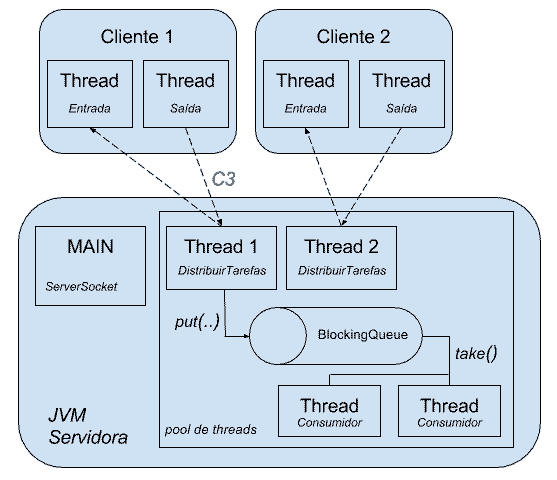

## Produzindo e Consumindo com Threads

- No último capítulo, mostramos uma forma de processamento de uma tarefa/task que devolve um resultado. Vimos aquelas interfaces Callable e Future. Callable é uma alternativa à Runnable, e o Future recebe o resultado da tarefa em execução. E até juntamos vários resultados através de uma thread dedicada.

- Há casos, principalmente na integração, onde queremos entregar um comando ou um dado em geral ao servidor, mas o cliente que enviou o comando não tem interesse no resultado de execução. O único objetivo do cliente é entregar o comando para garantir que será processado.

- O que realmente acontece com o resultado desse comando depende da aplicação. Por exemplo, poderia ser gravado no banco de dados ou poderia ser interessante para algum outro cliente.

### Produtores e Consumidores
Nesse estilo de comunicação, o cliente que entrega o comando é chamado de produtor, e se há um cliente que recebe o resultado, ele é chamado de consumidor. Esse conceito ou estilo de comunicação foi batizado com o nome mensageria. Vamos tentar simular essa forma de comunicação, um pouco mais simplificado do que um servidor de mensageria profissional, mas mesmo assim vale muito a pena para entender e praticar novidades do mundo de threads.

- A ideia é a seguinte: ao receber o comando no servidor, não vamos processar nada na hora e sim apenas adicionar o comando em uma fila. A fila é o lugar onde ficam guardados os comandos a serem processados. Nela, terão alguns consumidores que ficarão lendo os comandos e realmente processando os dados. Veja a nossa ideia apresentada no gráfico abaixo:


### Prova de conceito
- Antes de trabalhar com uma fila na nossa aplicação, vamos entender melhor o conceito através de um exemplo separado. Uma fila, ou Queue, faz parte da API de Collections do Java, que possui algumas interfaces, como List ou Set, além de Queue. Além disso, a interface Queue também estende a interface Collection, pois não deixa de ser um coleção de dados:


- A Queue, sendo uma interface, precisa de uma implementação e a mais comum é a LinkedList. Ou seja, a LinkedList não é só uma lista, como também uma fila:


### Trabalhando com java.util.Queue
- Para testar a Queue, vamos criar a classe TesteFila, no projeto experimento, com um método main. Por exemplo, podemos criar uma fila de Strings para guardar os nossos comandos:

```
import java.util.LinkedList;
import java.util.Queue;

public class TesteFila {

    public static void main(String[] args) {

        Queue<String> fila = new LinkedList<>();
    }
}
```

- Como a interface Queue é uma Collection, temos acesso aos métodos principais dessa interface para, por exemplo, adicionar (add), remover (remove) ou verificar se já existe um elemento (contains).

- No entanto, o que a gente ganha usando Queue ao invés da List? Há alguns métodos na interface Queue que podem ser interessantes, por exemplo o método offer() (oferecer) e o poll() (tirar). Ao invés de adicionar um elemento (chamando add), podemos oferecer um elemento. O offer() tem a vantagem de respeitar uma possível capacidade da fila, que veremos mais para frente. Além disso, ao invés de chamar remove(0), podemos usar o poll() (que devolve null se não tiver nenhum elemento).

> Veja o exemplo:
```
public class TesteFila {

    public static void main(String[] args) {

        Queue<String> fila = new LinkedList<>();
        fila.offer("c1");
        fila.offer("c2");
        fila.offer("c3");

        System.out.println(fila.poll());
        System.out.println(fila.poll());
        System.out.println(fila.poll());
        System.out.println(fila.poll()); //null

        System.out.println(fila.size()); //irá imprimir 0, pois o pool retira os elementos da fila
}
```

- Há outros métodos, como o peek(), para receber o primeiro elemento mas não remover, ou element(), que funciona igual ao peek(), mas joga uma exceção se não tiver nenhum elemento.

### Fila thread-safe: BlockingQueue
- Talvez você se lembre que falamos no curso Threads I que a maioria das implementações do java.util não são thread safe. Pois é, o nosso LinkedList também não é e por causa disso não pode ser utilizada no projeto servidor-tarefas.

- Felizmente há uma solução dentro desse pacote poderoso java.util.concurrent. Se quisermos usar uma fila com threads, devemos utilizar a interface BlockingQueue e uma das implementações dela. Mãos à obra :)


- O primeiro passo então é usar a interface BlockingQueue, e a nossa implementação será a ArrayBlockingQueue:

```
public class TesteFila {

    public static void main(String[] args) throws InterruptedException {

        BlockingQueue<String> fila = new ArrayBlockingQueue<>(3);

        fila.offer("c1");
        fila.offer("c2");
        fila.offer("c3");

        System.out.println(fila.poll());
        System.out.println(fila.poll());
        System.out.println(fila.poll());
        System.out.println(fila.poll());//null

        System.out.println(fila.size());
    }
}
```

- Tudo deve continuar compilando e rodando, já que BlockingQueue estende a interface Queue, com a diferença que a ArrayBlockingQueue é thread safe.


### Detalhes da ArrayBlockingQueue
- Mas há mais diferenças? Será que o nome Blocking na interface e na implementação não tem um significado? Claro que tem e será mostrado agora :).

- Há métodos que simplesmente travam a thread para disponibilizar um elemento ou tirar um elemento na fila. Isto é importante, pois queremos criar produtores e consumidores para a mesma fila, tudo assincronamente em threads separadas.

- Por exemplo, para consumir um elemento da fila, podemos trocar o método poll() por take(). O take() espera até o próximo elemento ficar disponível na fila e assim trava a thread.

> Veja o código abaixo que trava a thread MAIN no quarto take():

```
public class TesteFila {

    public static void main(String[] args) throws InterruptedException {

        BlockingQueue<String> fila = new ArrayBlockingQueue<>(3);
        fila.offer("c1");
        fila.offer("c2");
        fila.offer("c3");        

        System.out.println(fila.take());
        System.out.println(fila.take());
        System.out.println(fila.take());
        System.out.println(fila.take());//trava o main aqui

        System.out.println(fila.size());
    }
}
```

- Além disso, temos o método o put para adicionar um elemento na fila, mas respeitando a capacidade da fila. Em outras palavras, se a fila estiver cheia o put esperará até que haja capacidade. Isso é importante, pois a nossa implementação ArrayBlockingQueue tem um limite definido. Veja o código abaixo:

```
public class TesteFila {

    public static void main(String[] args) throws InterruptedException {

        BlockingQueue<String> fila = new ArrayBlockingQueue<>(3); //max 3 elementos
        fila.put("c1");
        fila.put("c2");
        fila.put("c3");
        fila.put("c4"); //trava o MAIN

        System.out.println(fila.take());
        System.out.println(fila.take());
        System.out.println(fila.take());

        System.out.println(fila.size());
    }
}
```

- Como a nossa fila aceita apenas 3 elementos, ao tentar adicionar o quarto elemento, a thread MAIN trava também.

### Usando o BlockingQueue no servidor
- Uma vez que conhecemos as principais funcionalidades de um Queue e BlockingQueue, podemos voltar ao nosso projeto servidor-tarefas para implementar o produtor e o consumidor. O primeiro passo é criar a fila dentro da classe ServidorTarefa. Vamos inicializar o ArrayBlockingQueue dentro do construtor com uma capacidade pequena de 2 elementos:

```
public class ServidorTarefas {

    private ServerSocket servidor;
    private ExecutorService threadPool;
    private AtomicBoolean estaRodando;
    private BlockingQueue<String> filaComandos;

    public ServidorTarefas() throws IOException {

        System.out.println("---- Iniciando Servidor ----");
        this.servidor = new ServerSocket(12345);
        this.threadPool = Executors.newFixedThreadPool(4,
                new FabricaDeThreads());
        this.estaRodando = new AtomicBoolean(true);
        this.filaComandos = new ArrayBlockingQueue<>(2);
    }

    // restante do código
}
```

- Uma vez criada a fila, podemos passá-la para a classe DistribuirTarefas. Adicionaremos mais um parâmetro no construtor:

-  método rodar() da classe ServidorTarefas, passaremos a fila como segundo parâmetro
```
DistribuirTarefas distribuidor = new DistribuirTarefas(threadPool, filaComandos, socket, this);
```

- É preciso ajustar o construtor da classe DistribuirTarefas, mas isso não deve gerar dificuldade para nós:

```
public class DistribuirTarefas implements Runnable {

    private Socket socket;
    private ServidorTarefas servidor;
    private ExecutorService threadPool;
    private BlockingQueue<String> filaComandos;

    public DistribuirTarefas(ExecutorService threadPool, BlockingQueue<String> filaComandos, Socket socket,
            ServidorTarefas servidor) {
        this.threadPool = threadPool;
        this.filaComandos = filaComandos;
        this.socket = socket;
        this.servidor = servidor;
    }

    // restante do código
}
```

- O próximo passo é oferecer o novo comando para a fila. A nossa ideia simplória é que o comando "c3" automaticamente fique na fila. No switch da classe DistribuirTarefas, vamos criar um novo case que joga o comando na fila:

```
case "c3" : {
    this.filaComandos.put(comando); //lembrando, bloqueia se tiver cheia
    saidaCliente.println("Comando c3 adicionado na fila");
        break;
}
```

- Repare que usamos o método put(), da fila que bloqueia a execução se não tiver espaço na fila. Esse código já deve ser o suficiente para enviar o comando c3 e guardar na fila. Podemos testar isso e tentar enviar 3 comandos c3. Após o segundo comando, a thread do cliente ficará bloqueada no lado do servidor. Em outras palavras, o cliente não conseguirá mais enviar nem receber comandos.

### Consumindo comandos
- Já temos comandos na fila, falta consumir, certo? Consumir significa criar as threads que "ficam de olho na fila" e tiram os elementos dela!

- Vamos criar uma nova tarefa que recebe a fila. Nesse caso, podemos utilizar a interface Runnable mesmo, pois não estamos interessados em devolver algo:

```
public class TarefaConsumir implements Runnable {

    private BlockingQueue<String> filaComandos;

    public TarefaConsumir(BlockingQueue<String> filaComandos) {
        this.filaComandos = filaComandos;
    }

    @Override
    public void run(){

    }
}
```

- Dentro do método run(), vamos usar o método take() da fila e verificar dentro de um laço a existência de um novo comando:

```
@Override
public void run() {

    try {
        String comando = null;

        while ((comando = filaComandos.take()) != null) {
            System.out.println("Consumindo comando " + comando + ", "
                    + Thread.currentThread().getName());
            Thread.sleep(10000);
        }
    } catch (InterruptedException e) {
        throw new RuntimeException(e);
    }
}
```

- Lembrando que o método take() bloqueia a thread. Agora só falta inicializar algumas threads com essa tarefa de consumo. :) Isso faremos na classe ServidorTarefas, através de um método auxiliar:

```
// na classe ServidorTarefas
private void iniciarConsumidores() {
    int qtdConsumidores = 2;
    for (int i = 0; i < qtdConsumidores; i++) {
        TarefaConsumir tarefa = new TarefaConsumir(filaComandos);
        this.threadPool.execute(tarefa);
    }
}
```

- Esse método, que inicializa e executa dois consumidores pelo pool, deve ser chamado no construtor. Vamos mudar também o threadPool para cachedThreadPool:

```
// no construtor da classe ServidorTarefas

public ServidorTarefas() throws IOException {
    System.out.println("---- Iniciando Servidor ----");
    this.servidor = new ServerSocket(12345);
    this.threadPool = Executors.newCachedThreadPool(new FabricaDeThreads());
    this.estaRodando = new AtomicBoolean(true);
    this.filaComandos = new ArrayBlockingQueue<>(2);
    iniciarConsumidores();
}
```

- Agora sim, podemos usar o comando c3 várias vezes e os consumidores vão pegar o comando da fila.

- Para melhor entendimento, segue a nossa arquitetura no gráfico:




## Testando BlockingQueue
- Antes de trabalhar com uma fila na nossa aplicação, vamos entender melhor a Queue através de um exemplo separado, como foi apresentado na aula. Uma fila, ou Queue, faz parte da API de Collections do Java. Além disso, a interface Queue também estende a interface Collection, pois não deixa de ser uma coleção de dados:


- A Queue, sendo uma interface, precisa de uma implementação e a mais comum é a LinkedList. No entanto a LinkedList não é thread safe. Se quisermos usar uma fila com threads, devemos utilizar a interface BlockingQueue e uma das implementações dela.


- 1) No seu projeto experimento crie uma nova classe TesteFila e use a interface BlockingQueue, a implementação será o ArrayBlockingQueue:

```
public class TesteFila {

    public static void main(String[] args) throws InterruptedException {

        //capacidade de 3 elementos apenas
        BlockingQueue<String> fila = new ArrayBlockingQueue<>(3);

        System.out.println(fila.size());// imprime 0
    }
}
```

- 2) Agora insira e recupere alguns elementos usando os métodos offer e poll:

```
//criando BlockingQueue omitido

fila.offer("c1");
fila.offer("c2");
fila.offer("c3");

System.out.println(fila.poll());
System.out.println(fila.poll());
System.out.println(fila.poll());
System.out.println(fila.poll());//devolve null
```

- 3) Teste também os métodos put (em vez de offer) e take (em vez de poll). Lembrando que put e take são bloqueantes.

- Só mais uma dica: os métodos offer e poll (que não são bloqueantes) possuem uma versão que recebe um timeout:

```
//tenta inserir um novo elemento por 30s
boolean foi = fila.offer("c3", 30, TimeUnit.SECONDS);

// tenta pegar um elemento por 30s
String comando = fila.poll(30, TimeUnit.SECONDS);
```

- Agora que conhecemos a interface Queue e a implementação ArrayBlockingQueue, podemos mexer no nosso servidor! 

> Sabemos que ambos os métodos, offer() e put() da interface BlockingQueue inserem um elemento na fila.
- Ao tentar adicionar um elemento na fila "sem vaga", o método put() bloqueia a execução aguardando por uma vaga dentro da lista. Já o método offer() não bloqueia e retorna false caso não haja mais espaço na fila.
- [documentação da classe BlockingQueue.](https://docs.oracle.com/javase/8/docs/api/java/util/concurrent/BlockingQueue.html)

> Considere que três threads estão bloqueadas por terem chamado o método take(), da interface BlockingQueue
- Ao ser inserido um elemento, uma dessas threads irá ser desbloqueada e irá receber esse elemento.

- Uma vez que conhecemos as principais funcionalidades da BlockingQueue, podemos voltar ao nosso projeto servidor-tarefas para implementar o produtor e o consumidor da fila.

- 1) O primeiro passo é criar a ArrayBlockingQueue dentro da classe ServidorTarefa. Inicialize o ArrayBlockingQueue dentro do construtor com uma capacidade pequena de 2 elementos:

> Classe: ServidorTarefas

- 2) Uma vez criada a fila, podemos passá-la para a classe DistribuirTarefas. Adicione mais um parâmetro no construtor e modifique-o na classe:

```
// método rodar() da classe ServidorTarefas, passaremos a fila como segundo parâmetro
DistribuirTarefas distribuidor = new DistribuirTarefas(threadPool, filaComandos, socket, this);
```

> Classe: DistribuirTarefas

- 3) No switch da classe DistribuirTarefas, crie um novo case que oferece o comando à fila:

```
case "c3" : {
    this.filaComandos.put(comando); //lembrando, bloqueia se tiver cheia
    saidaCliente.println("Comando c3 adicionado na fila");
    break;
}
```

- 4) Vamos consumir os comandos, ou seja criar a thread que "fica de olho na fila" e tira os elementos dela! Para tal, crie uma nova tarefa utilizando a interface Runnable mesmo, pois não estamos interessados em devolver algo. A tarefa deve receber a nossa fila de comandos:

> Classe: TarefaConsumir


- 5) No método run() da classe TarefaConsumir, use o método take() para verificar se existe um novo comando:

```
@Override
public void run() {

        try {
            String comando = null;

            //enquanto existe um novo comando, lembrando take() bloqueia
            while ((comando = filaComandos.take()) != null) { 
                System.out.println("Consumindo comando " + comando + ", " + Thread.currentThread().getName());
                Thread.sleep(20000); //demorando 20s para consumir
            }
    } catch (InterruptedException e) {
        throw new RuntimeException(e);
    }
}
```

- 6) Com a tarefa criada, vamos inicializar algumas threads com essa tarefa para consumir os comandos :) Na classe ServidorTarefas adicione um método auxiliar:

```
// na classe ServidorTarefas
private void iniciarConsumidores() {
    int qtdCondumidores = 2;
    for (int i = 0; i < qtdCondumidores; i++) {
        TarefaConsumir tarefa = new TarefaConsumir(filaComandos);
        this.threadPool.execute(tarefa);
    }
}
```

- Esse método inicializa e executa dois consumidores pelo pool.

- 7) Chamar o método iniciarConsumidores no construtor da classe ServidorTarefas:

```
// no construtor da classe ServidorTarefas
public ServidorTarefas() throws IOException {
    System.out.println("---- Iniciando Servidor ----");
    this.servidor = new ServerSocket(12345);
    this.threadPool = Executors.newFixedThreadPool(4, new FabricaDeThreads());
    this.estaRodando = new AtomicBoolean(true);
    this.filaComandos = new ArrayBlockingQueue<>(2);
    iniciarConsumidores(); //novo
}
```

- 8) Inicialize o servidor e rode o cliente (parando todos os consoles antes). Envie pelo cliente o comando c3 pelo menos duas vezes. Os consumidores devem pegar e consumir os comandos da fila. Fique atento ao console:


- Repare que nossa fila tem uma capacidade muito pequena de apenas 2 elementos e temos apenas duas threads que podem consumir os comandos da fila.

- O que acontece quando enviarmos muito rápido 4 comandos c3 do cliente para o servidor (rapido significa dentro de 20s)?

- Veja a saída desse exemplo no console do Eclipse:


- Nesse caso, as duas threads consumidores estão ocupadas ainda, então os comandos ficam guardados na fila até uma thread vir tirar. O servidor confirma apenas o recebimento do comando mas não consume ainda. Depois de 20s as threads estão sendo liberadas e começam consumir esses comandos também:


### Processando comandos com ordem natural
- Em algumas situações, é necessário garantir a ordem dos elementos da nossa fila com base em outros critérios. No nosso projeto, apresentamos o comando através de uma simples string, mas poderíamos criar uma classe para guardar mais informações sobre o comando:

```
public class Comando {

    private String tipo;
    private int prioridade;
    private String params;

    //construtor e getters

}
```

- Além de prioridade, mais informações poderiam ser úteis, como a data de criação ou quem é o cliente. A ideia é que o cliente não envie apenas c1 ou c2, mas sim um comando mais completo como, por exemplo:

`ADD-3?curso=threads2&dataCriacao=12/06/2016&nivel=avancado`

- O comando aqui é ADD com a prioridade 3, além de enviar vários parâmetros.

- Repare que isso já tem muito mais a ver com um protocolo de verdade, onde a primeira parte é o tipo do comando, seguido pelo número da prioridade, seguido pelos parâmetros:

### TIPO-PRIORIDADE?PARAMS
- A primeira ideia seria usar a nossa implementação da fila ArrayBlockingQueue e adicionar um comando depois do outro:

```
BlockingQueue<Comando> comandos = new ArrayBlockingQueue<>(5);

// new Comando(nome_do_comando, prioridade, params)
comandos.put(new Comando("ADD", 5, "curso=threads2&dataCriacao=12/06/2016&nivel=avancada"));
comandos.put(new Comando("UPDATE", 3, "curso=threads2&dataCriacao=13/06/2016")); 
comandos.put(new Comando("REMOVE", 1, "id=3"));
comandos.put(new Comando("GET", 2, "id=4"));

//imprimindo comandos
Comando comando = null;
while((comando = comandos.take()) != null) { 
    System.out.println(comando.getTipo() + " - " + comando.getPrioridade());
}
```

> Com a saída:
```
ADD - 5
UPDATE - 3
REMOVE - 1
GET - 2
```

- Ao tentar consumir esses comandos, podemos ver que o primeiro que entrar será o primeiro a sair (First in, first out). O problema é que nesse cenário entra em jogo a prioridade, como então podemos utilizá-la para estabelecer uma ordem de consumo para os comandos?

- Para esse tipo de situação, pode ser útil conhecer um outro tipo de implementação de BlockingQueue: a PriorityBlockingQueue. Para usar essa implementação, precisamos que a classe Comando implemente a interface Comparable e por isso implemente o método compareTo:

```
public class Comando implements Comparable<Comando> {
    private String tipo;
    private int prioridade;
    private String params;

    public Comando(String tipo, int prioridade, String params) {
        this.tipo = tipo;
        this.prioridade = prioridade;
        this.params = params;
    }

    // construtor e getters

    @Override
    public int compareTo(Comando outroComando) {
        return outroComando.prioridade - prioridade;
    }
}
```


- E no teste trocaremos a implementação ArrayBlockingQueue por PriorityBlockingQueue (repare que ela não recebe um limite no construtor como a ArrayBlockingQueue).

> O código final deve ficar assim:

```
BlockingQueue<Comando> comandos = new PriorityBlockingQueue<>();

comandos.put(new Comando("ADD", 5, "curso=threads2&dataCriacao=12/06/2016&nivel=avancada"));
comandos.put(new Comando("UPDATE", 3, "curso=threads2&dataCriacao=13/06/2016")); 
comandos.put(new Comando("REMOVE", 1, "id=3"));
comandos.put(new Comando("GET", 2, "id=4"));

Comando comando = null;
while((comando = comandos.take()) != null) { 
    System.out.println(comando.getTipo() + " - " + comando.getPrioridade());
}
```

> E portanto na saída:
```
ADD - 5
UPDATE - 3
GET - 2
REMOVE - 1
```