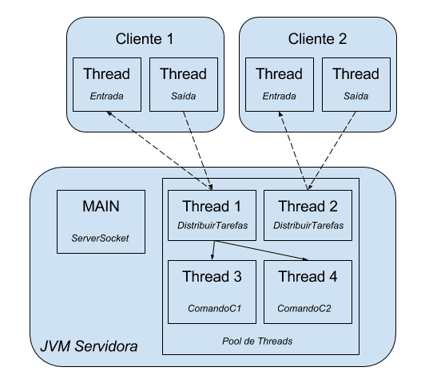
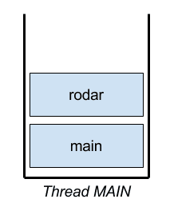
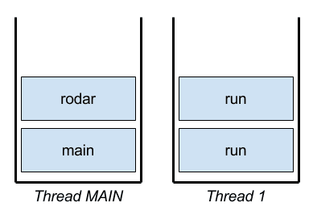
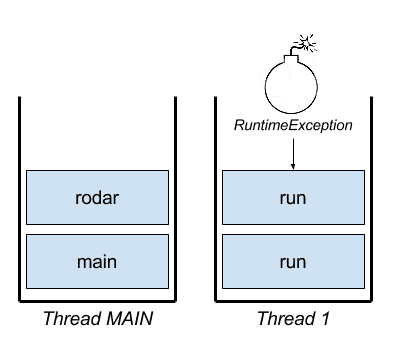
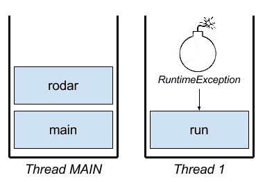
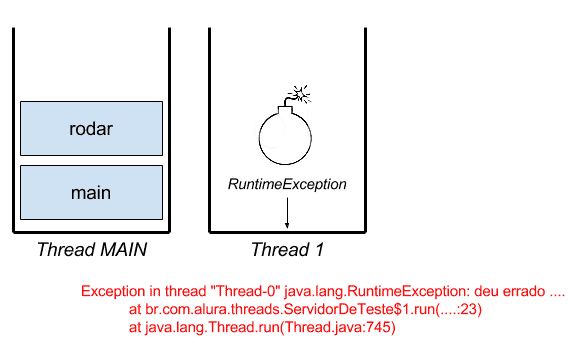
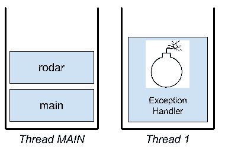

## Distribuindo comandos e tratamento de erro

### Distribuindo comandos
- Vamos continuar com o nosso projeto servidor-tarefas e, claro, aprender novos recursos sobre threads. Criamos a classe DistribuirTarefas com o objetivo de receber os comandos do cliente. Isso já está acontecendo, implementamos a funcionalidade através do switch, que não é tão elegante mas resolve o nosso problema:

```
switch (comando) {
    case "c1": {
        saidaCliente.println("Confirmação do comando c1");
        break;
    }
    case "c2": {
        saidaCliente.println("Confirmação do comando c2");
        break;
    }
    case "fim": {
        saidaCliente.println("Desligando o servidor");
        servidor.parar();
        return; //saindo do metodo
    }
    default: {
        saidaCliente.println("Comando não encontrado");
    }
}
```
- O que não está acontecendo é a distribuição em si! A ideia dessa classe é que cada comando será executado em uma nova thread, pois o comando pode executar algo demorado, como um cálculo pesado, integrações com outros sistema ou acesso ao banco de dados. Usando uma nova thread, não vamos bloquear o recebimento de novos comandos através do mesmo cliente. Bora implementar?

### Cada comando, um Runnable
- Vamos simular os dois comandos que fazem parte do nosso protocolo, c1e c2. Cada comando será a tarefa de uma thread. Aqui não há novidade, usamos a nossa velha conhecida interface Runnable:
```
public class ComandoC1 implements Runnable {

    @Override
    public void run() {
        // faz algo bem demorado
    }
}
```
- E o ComandoC2:
```
public class ComandoC2 implements Runnable {

@Override
    public void run() {
        // faz algo bem demorado
    }
}
```
- Cada comando deve devolver o resultado da execução, ou pelo menos informar ao cliente que a execução foi finalizada. Para tal, recebemos no construtor a saída do cliente:

```
public class ComandoC1 implements Runnable {

    private PrintStream saida;

    public ComandoC1(PrintStream saida) {
        this.saida = saida;
    }

    @Override
    public void run() {

        System.out.println("Executando comando c1");

        try {
            // faz algo bem demorado
            Thread.sleep(20000);
        } catch (InterruptedException e) {
            throw new RuntimeException(e);
        }
        //devolvendo resposta para o cliente
        saida.println("Comando c1 executado com sucesso!");
    }
}
```
- Repare que usamos o Thread.sleep(20000) para simular a demora na execução. O ComandoC2 ficará igual a essa, mudando somente as impressões, mas mais para frente faremos alterações nele. Por enquanto, os dois comandos são iguais.

### Executando as threads
- Com os comandos implementados, podemos pensar na criação das threads. Aqui também não há novidade e poderíamos criar uma nova para cada comando enviado pelo cliente. Já sabemos que devemos ter cuidado na hora de criar novas threads, pois há um custo operacional envolvido. Resolvemos essa questão através do pool que já temos criado, que também utilizaremos agora.

- Quando criarmos a classe DistribuirTarefas, passaremos o pool (threadPool) como primeiro argumento do construtor:

```
// na classe ServidorTarefas
// no método rodar()
DistribuirTarefas distribuidor = new DistribuirTarefas(threadPool, socket, this);
```

- Na classe DistribuirTarefas, podemos então utilizar o pool para rodar os nossos comandos:

```
public class DistribuirTarefas implements Runnable {

    private Socket socket;
    private ServidorTarefas servidor;
    private ExecutorService threadPool;

    public DistribuirTarefas(ExecutorService threadPool, Socket socket, ServidorTarefas servidor) {
        this.threadPool = threadPool; // recebendo o threadPool e associando a uma variável local
        this.socket = socket;
        this.servidor = servidor;
    }

    @Override
    public void run() {

        // restante do código omitido

        switch (comando) {
            case "c1": {
                saidaCliente.println("Confirmação do comando c1");
                ComandoC1 c1 = new ComandoC1(saidaCliente);
                this.threadPool.execute(c1);
                break;
            }
            case "c2": {
                saidaCliente.println("Confirmação do comando c2");
                ComandoC2 c2 = new ComandoC2(saidaCliente);
                this.threadPool.execute(c2);
                break;
            }
            // outro case e default omitidos
        }
        // restante do código omitido
    }
}
```
- Isso já é suficiente para distribuir os comandos em novas threads. Para deixar mais claro, segue um desenho que mostra a nossa arquitetura no lado do servidor:



- Que tal testar exatamente esse desenho? Temos dois clientes conectados e o cliente 1 enviou dois comandos, c1 e c2.

- Para ver a nossa distribuição funcionar, vamos utilizar FixedThreadPool com um máximo de 4 threads. Para isso, alteraremos o construtor da classe ServidorTarefas:

```
public ServidorTarefas() throws IOException {
    System.out.println("---- Iniciando Servidor ----");
    this.servidor = new ServerSocket(12345);
    //usando FixedThreadPool, max 4 Threads
    this.threadPool = Executors.newFixedThreadPool(4);
    this.estaRodando = new AtomicBoolean(true);
}
```

- Isso significa que nosso pool não vai permitir mais do que 4 threads. Com dois clientes conectados, já usamos duas threads, basta então enviar dois comandos para esgotar o pool. Qualquer outro comando enviado não será confirmado até uma thread ser liberada.

### E se um erro acontece na threads?
- Criamos os comandos com a motivação de fazer um processamento demorado, por exemplo, um cálculo pesado ou a integração com outros sistemas. Com certeza, em algum momento, podem acontecer exceções nesse processamento. A pergunta é, como vamos lidar com as exceções que vão acontecer em nossas threads?

- Antes de implementar um tratamento de erro no nosso projeto servidor-tarefas, vamos executar um teste separado. Podemos aproveitar o projeto experimento, que usamos para entender a palavra chave volatile. Nele, criamos uma thread separada e agora geraremos uma exceção explicitamente nela:

```
// projeto experimento

public class ServidorDeTeste {

// atributo e main comentados

    private void rodar() {
        try {
            new Thread(new Runnable() {

                public void run() {
                    System.out.println("Servidor começando, estaRodando = "
                            + estaRodando);
                    while (!estaRodando) {
                    }

                    if (estaRodando) {
                        throw new RuntimeException("Deu erro na thread...");
                    }

                    System.out.println("Servidor rodando, estaRodando = "
                            + estaRodando);

                    while (estaRodando) {
                    }

                    System.out.println("Servidor terminando, estaRodando = "
                            + estaRodando);
                }
            }).start();
        } catch (Exception e) {
            System.out.println("Catch na thread MAIN " + e.getMessage());
        }
    }

    // método alterandoAtributo comentado
}
```

- Repare que estamos jogando uma RuntimeException dentro do método run. Além disso, toda a thread está envolvida em um bloco try-catch. Em outras palavras, não só jogamos uma exceção, como também tentamos resolvê-la.

- Vamos testar o código e rodar a classe ServidorDeTeste. O esperado seria que o bloco catch capture a exceção e imprima a mensagem no console, mas veja a saída:
```
Servidor começando, estaRodando = false
Main alterando estaRodando = true
Exception in thread "Thread-0" java.lang.RuntimeException: deu errado ....
    at br.com.alura.threads.ServidorDeTeste$1.run(ServidorDeTeste.java:23)
    at java.lang.Thread.run(Thread.java:745)
Main alterando estaRodando=false
```
- Repare que a mensagem da exceção não apareceu! A exceção explodiu no console e a thread main parece não estar ligando muito para isso!

### Cada thread a sua pilha
- Quando inicializamos o nosso programa, a JVM cria automaticamente a thread MAIN e ela sempre começa no método main (que surpresa). O main é o primeiro método na pilha de métodos! Se chamamos um novo método a partir do main, este fica no topo dessa pilha e assim por diante:



- Como inicializamos uma nova thread, essa também terá a sua pilha, independente da thread MAIN. A diferença é que essa pilha começa com o método run, da classe Thread, que por sua vez chama o método run da tarefa (Runnable) :



- Essa pilha também é visível na saída do console que recebemos antes, pois mostra o caminho que a exceção traçou. Quando ocorre uma exceção no nosso código, ele se comporta como um bomba que cai em cima da pilha.



- Se não há nenhum bloco try-catch, essa bomba vai remover o método da pilha:



- E se não existe mais nenhum método na pilha, o rastro da exceção aparece no console:



- Repare que a exceção anda totalmente independente da outra pilha. Mesmo com a exceção na Thread 1, a thread MAIN continua rodando. Também não adianta tentar pegar a exceção através de um try-catch!

- Será que não há uma outra forma de centralizar o tratamento de erro ou é realmente preciso espalhá-lo em cada tarefa/comando?

### Capturando exceções
- A resposta está na classe Thread, no método setUncaughtExceptionHandler. Podemos passar um objeto que recebe a exceção, caso aconteça, para a thread. Achamos o lugar central para o tratamento!

- Vamos testar o ExceptionHandler, ainda no projeto experimento:

```
// na classe ServidorDeTeste, do projeto experimento

private void rodar() {
    // sem try - catch

    Thread thread = new Thread(new Runnable() {

        public void run() {
            // código que gera uma exceção omitido
        }
    });

    // passando o objeto com a responsabilidade de tratamento de erro
    thread.setUncaughtExceptionHandler(new TratadorDeExcecao());

    thread.start();
}
```

- Repare que apagamos o try-catch e usamos uma variável para a thread.

- A classe TratadorDeExcecao deve implementar a interface UncaughtExceptionHandler, que possui um único método:

```
public class TratadorDeExcecao implements UncaughtExceptionHandler {

    @Override
    public void uncaughtException(Thread t, Throwable e) {
        System.out.println("Deu exceção na thread " + t.getName() + ", "
                + e.getMessage());
    }
}
```


- Já podemos testar o código e rodar novamente a classe ServidorDeTeste. A saída no console mostrará a mensagem de erro, mas agora sem traço da pilha! A exceção foi repassada para a classe TratadorDeExcecao:

```
Servidor começando, estaRodando = false
Main alterando estaRodando = true
Deu exceção na thread Thread-0, Deu erro na thread...
Main alterando estaRodando = false
```


- Ótimo, mas será que vai ajudar no nosso projeto servidor-tarefas?

### Usando a fábrica de threads

- Agora está na hora de aplicar essa forma de tratamento de exceções em threads no nosso projeto servidor-tarefas, mas ainda temos um problema para resolver. No exemplo anterior, criamos uma instância da classe Thread na mão, no entanto no projeto servidor-tarefas usamos um pool de threads! Não temos acesso direto às instâncias de threads.

- O problema é, sem ter esse acesso, como vamos passar o ExceptionHandler? A solução está no método que cria o pool de threads. Cada método da classe Executors -- tanto faz se criarmos um pool fixo ou cached -- é sobrecarregado e pode receber um segundo parâmetro:

```
//construtor da classe ServidorTarefas

public ServidorTarefas() throws IOException {
    System.out.println("---- Iniciando Servidor ----");
    this.servidor = new ServerSocket(12345);
    this.threadPool = Executors.newFixedThreadPool(4, new FabricaDeThreads());
    this.estaRodando = new AtomicBoolean(true);
}
```


- A fábrica deve implementar a interface ThreadFactory e possuir um método que será chamado através do pool, se ele precisar de uma nova thread. Nesse método, vamos criar a thread e adicionar o tratador de exceções. Aproveitamos também para dar um nome à thread:

```
public class FabricaDeThreads implements ThreadFactory {

    private static int numero = 1;

    @Override
    public Thread newThread(Runnable r) {

        Thread thread = new Thread(r, "Thread Servidor Tarefas " + numero);

        numero++;

        thread.setUncaughtExceptionHandler(new TratadorDeExcecao());

        return thread;
    }
}
```

- Está quase tudo pronto para testar, mas não podemos nos esquecer de copiar a classe TratadorDeExcecao do projeto experimento para o projeto servidor-tarefas.

- Para realmente ver o tratador funcionando, forçaremos uma exceção na classe ComandoC2:

```
public class ComandoC2 implements Runnable {

    // atributo e construtor omitido

    @Override
    public void run() {

        // toda implementação omitida

        throw new RuntimeException("Exception no comando c2");
    }
 }
```

- Ao rodar o nosso servidor e conectar um cliente, devemos enviar o comando c2. No console do servidor deve aparecer a saída do ExceptionHandler:

```
---- Iniciando Servidor ----
Distribuindo as tarefas para o cliente Socket[addr=/127.0.0.1,port=64388,localport=12345]
Comando recebido c2
c2
Executando comando c2
Deu exceção na thread Thread Servidor Tarefas 2, Exception no comando c2
```


> O que acontece quando uma exceção não tratada é lançada dentro de uma Thread?
- Será propagada até o método run() e encerrará a Thread

> Suponha que uma Thread A inicialize uma Thread B, onde ocorre um RuntimeException não tratado. Quais Threads serão finalizadas com essa exceção?
- Somente Thread B


## Agora vamos implementar o tratamento de exceção para nossas threads.

- 1) Para isso, crie a classe TratadorDeExcecao dentro do pacote br.com.alura.servidor:

```
import java.lang.Thread.UncaughtExceptionHandler;

public class TratadorDeExcecao implements UncaughtExceptionHandler {

    @Override
    public void uncaughtException(Thread thread, Throwable ex) {
        System.out.println("Exceção na thread " + thread.getName() + ", " + ex.getMessage());
    }
}
```

- Repare que estamos imprimindo apenas uma mensagem caso uma exceção aconteça.

- 2) Para poder usar a classe TratadorDeExcecao, crie uma nova classe FabricaDeThreads que representa fábrica de threads (quem diria :) ). Implemente a interface ThreadFactory e sobrescreva o método newThread(..):

```
public class FabricaDeThreads implements ThreadFactory {

    @Override
    public Thread newThread(Runnable tarefa) {

    }
}
```

- 3) Agora vamos implementar a fábrica. Crie um atributo estático na classe, para contar as threads criadas:

```
    private static int numero = 1;
```

- 4) No método newThread(..) instancie uma nova thread, passando no construtor a tarefa (Runnable) e o numero de threads:

```
    Thread thread = new Thread(tarefa, "Thread Servidor Tarefas " + numero);
    numero++;
    return thread;
```

- 5) Ainda no método newThread(..), após o increment, passe para a thread o nosso TratadorDeExcecao e sete o thread como daemon

```
    thread.setUncaughtExceptionHandler(new TratadorDeExcecao());
    thread.setDaemon(true);
```

- Segue o código completo da fábrica:
```
public class FabricaDeThreads implements ThreadFactory {

    private static int numero = 1;

    @Override
    public Thread newThread(Runnable tarefa) {
        Thread thread = new Thread(tarefa, "Thread Servidor Tarefas " + numero);
        numero++;
        thread.setUncaughtExceptionHandler(new TratadorDeExcecao());
        thread.setDaemon(true);
        return thread;
    }
}
```

- Obs: Uma thread daemon é uma thread de "serviço" que será automaticamente terminada quando não houver mais nenhuma outra thread principal rodando dentro da JVM. Vimos essa funcionalidade no primeiro curso sobre threads.

- 6) Por último é preciso instanciar a fábrica e passar para o threadPool. Para isso, abra a classe ServidorTarefas e procure o construtor:

- Substitua a linha abaixo:
```
this.threadPool = Executors.newFixedThreadPool(4);//talvez esteja usando CachedThreadPool
```
- por:
```
this.threadPool = Executors.newFixedThreadPool(4, new FabricaDeThreads());
```

- 7) Sem nenhum console ativo no Eclipse rode a classe ServidorTarefas e depois o cliente. Envie comando, tudo deve continuar funcionando!

### Para saber mais: ThreadFactory padrão
- No capítulo usamos a nossa própria implementação da interface ThreadFactory para personalizar a criação das threads no pool.

- Quando não usamos uma ThreadFactory explicitamente é utilizada a implementação padrão que podemos acessar através:

```
ThreadFactory factory = Executors.defaultThreadFactory();
```

- [No javadoc desse método consta:](https://docs.oracle.com/javase/7/docs/api/java/util/concurrent/Executors.html#defaultThreadFactory%28%29)

- Each new thread is created as a non-daemon thread with priority set to the smaller of Thread.NORM_PRIORITY and the maximum priority permitted in the thread group. New threads have names accessible via Thread.getName() of pool-N-thread-M, where N is the sequence number of this factory, and M is the sequence number of the thread created by this factory.

- Ou seja, é criado uma thread que não é daemon com uma prioridade mais baixa do que Thread.NORM_PRIORITY, além de usar uma nomenclatura padrão.

- Mas qual é a utilidade disso, já que temos a nossa própria fábrica que funciona corretamente?

- Uma razão para conhecer a fábrica padrão seria aproveitar ela mesmo usando uma fábrica personalizada. Assim seguimos uma implementação correta e só fazemos ajustes nas threads criadas pela fábrica padrão!

### Opcional: Modificando o código e tratamento de erro
- Veja o código abaixo que faz a leitura de arquivos de propriedades em uma Thread. Modifique esse código de forma a erros de leitura serem tratados por um UncaughtExceptionHandler. Pode utilizar o projeto experimento:

```
import java.io.FileReader;
import java.util.Properties;

public class Principal {

    public static void main(String[] args) {
        Properties properties = new Properties();
        Thread thread = new Thread(new LeitorPropriedades(properties, "arquivo1.txt"));
        thread.start();
    }
}

public class LeitorPropriedades implements Runnable {

    private Properties propriedades;
    private String nomeArquivo;

    public LeitorPropriedades(Properties propriedades, String nomeArquivo) {
        this.propriedades = propriedades;
        this.nomeArquivo = nomeArquivo;
    }

    public void run() {
        try {
            this.propriedades.load(new FileReader(nomeArquivo));
        } catch (Exception e) {
            throw new RuntimeException(e);
        }
    }
}
```

- Não há mistério, devemos implementar a interface UncaughtExceptionHandler. Na solução abaixo usamos a interface diretamente na classe Principal. Depois, basta "setarmos" na nossa thread quem irá gerenciar os nossos erros, que no caso, é a nossa classe Principal:

```
import java.io.FileReader;
import java.lang.Thread.UncaughtExceptionHandler;
import java.util.Properties;

public class Principal implements UncaughtExceptionHandler{

    public static void main(String[] args) {
        Properties properties = new Properties();
        Thread thread = new Thread(new LeitorPropriedades(properties, "arquivo1.txt"));
        thread.setUncaughtExceptionHandler(new Principal());
        thread.start();
    }

    @Override
    public void uncaughtException(Thread thread, Throwable exception) {
        System.out.println("Exceção "+ exception +" capturada na Thread "+thread.getName());        
    }
}

//não modificamos a classe LeitorPropriedades
```

### Um pouco sobre padrões de projetos
- Padrões de projeto não foram inventados, eles vem da prática e alguém deu um nome bonito para tal!

- Pois é, de vez em quando usamos um padrão de projeto sem saber que ele existe! No nosso projeto já aplicamos alguns, principalmente no lado do servidor.

- Talvez o padrão mais simples de enxergar o Factory Method que utilizamos dentro da nossa fábrica de threads (FabricaDeThreads). Aquele único método newThread(..) é um factory method que encapsula a criação de uma thread. O pool de threads usa aquela fábrica para criar uma thread, usa o Factory Method.

- Outro padrão interessante aplicamos na classe DistribuirTarefas. Apesar da implementação simples, ela segue um padrão chamado de FrontController. Esse padrão na verdade vem do mundo de desenvolvimento web e representa uma entrada única na aplicação. Na nossa aplicação todos os "pedidos" dos clientes passam pela classe DistribuirTarefas. Ela centraliza o fluxo, analisa o pedido e decide (controla) o que é para executar. Isso é o papel do controlador ou FrontController.

- Por fim, temos os nossos comandos que seguem o padrão Command. Um Command encapsula a execução de "algo", encapsula alguma ação ou lógica. Em alguns casos os comandos são chamados de actions e eles realmente possuem todo o código para atender aquele pedido especifico do cliente. Enquanto o controlador analisa o pedido e decide qual comando a usar, o Command realmente possui a lógica.


- Factory Method (do famoso livro GoF)
- Command (também do GoF)
- FrontController (do não menos famoso livro PoEAA)